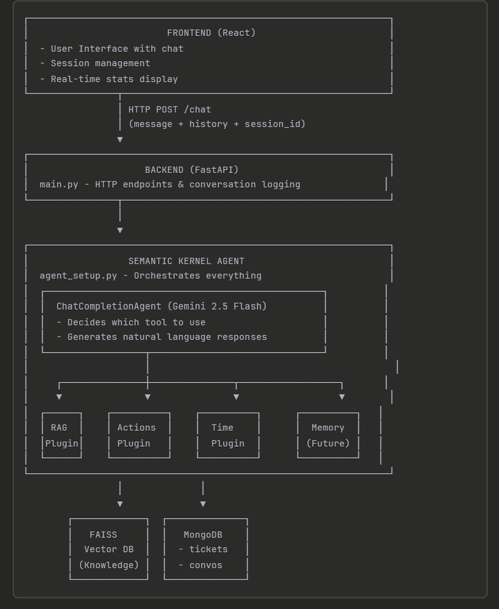
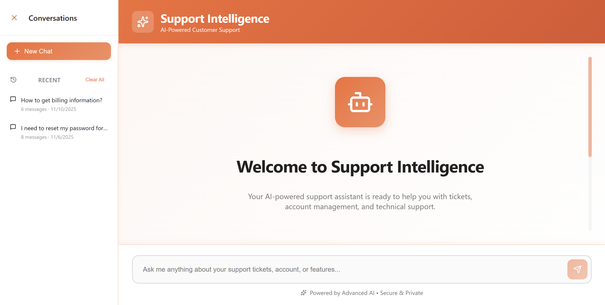

# 🤖 AI-Powered Client Support Agent  
> **Smart SaaS & IT Helpdesk Assistant** powered by **RAG**, **Semantic Kernel**, and **Gemini 2.5 Flash**

---

---

### 🧠 “A support agent that doesn’t just answer — it *understands*, *retrieves*, and *acts*.”

---

## 🚀 Overview

This project is an **AI-based client support system** designed for SaaS companies or internal IT teams.  
Users can ask questions like:
> “How do I reset my password?”  
> “What’s the status of my ticket T-123?”  
> “How do I export my dashboard metrics?”

The system:
- Retrieves relevant knowledge using **Retrieval-Augmented Generation (RAG)**
- Understands intent using **Semantic Kernel orchestration**
- Executes backend **function calls** dynamically
- Responds naturally using **Gemini 2.5 Flash**

All integrated into a clean **React + FastAPI** web application ⚡

---

## 🏗️ System Architecture Overview

> 

## 🔑 Key Technologies

| Component | Technology | Purpose |
|------------|-------------|----------|
| **Frontend** | React + Lucide Icons | User Interface |
| **Backend** | FastAPI | REST API & server logic |
| **AI Orchestration** | Semantic Kernel | Function calling, agent logic |
| **LLM** | Google Gemini 2.5 Flash | Conversational reasoning |
| **Embeddings** | Google `text-embedding-004` | Vector representations |
| **Vector DB** | FAISS | Context similarity search |
| **Database** | MongoDB | Chat logs & ticket data |
| **Language** | Python + JavaScript | Core development stack |

---

## 🖼️ Screenshots

### 🏠 Home Page

### 🔐 Password Reset Flow

---

📖 Technical Deep Dive (click to expand)

### 🧭 Plugins Architecture

- **Retriever Plugin:** Handles document lookups via FAISS.   
- **Action Plugin:** Executes live backend functions (password reset, ticket status).  
- **Time Plugin:** Adds contextual awareness (date/time responses).

---

### 🧩 Semantic Kernel Flow

1. Receives user query  
2. Checks available plugins  
3. Chooses the right function dynamically  
4. Executes tool and retrieves result  
5. Combines output with LLM reasoning to generate final response

---

### 💾 Database Design

- `tickets` collection → Ticket metadata & status  
- `conversations` collection → User history logging  
- **RAG data** stored in **FAISS** for fast retrieval  
- **MongoDB** handles relational context (ticket ↔ user ↔ chat)

---

## 🧾 Future Enhancements

- [ ] Add **OAuth2 agent login**  
- [ ] Add **voice-to-text query input**  
- [ ] Support **multi-LLM (Gemini + GPT)**  
- [ ] Integrate **email notification system** for ticket updates  
- [ ] Add **admin dashboard** for analytics  

---

## 🏁 Conclusion

This system demonstrates how **RAG**, **Semantic Kernel**, and **function calling** can power **intelligent SaaS support platforms** that go beyond Q&A — they *act.*

> 🧠 Contextual Understanding  
> ⚡ Real-Time Retrieval  
> 🧩 Dynamic Action Execution  

All in one unified architecture.

---

### 👨‍💻 Developed by  
**Nishyanth Nandagopal**  
   
### 🌐 Connect with Me
[LinkedIn](https://www.linkedin.com/in/nishyanth-nandagopal/) • [GitHub](https://github.com/Nishyanthn) • [Email](mailto:nishyanthnandagopal@gmail.com)

---

